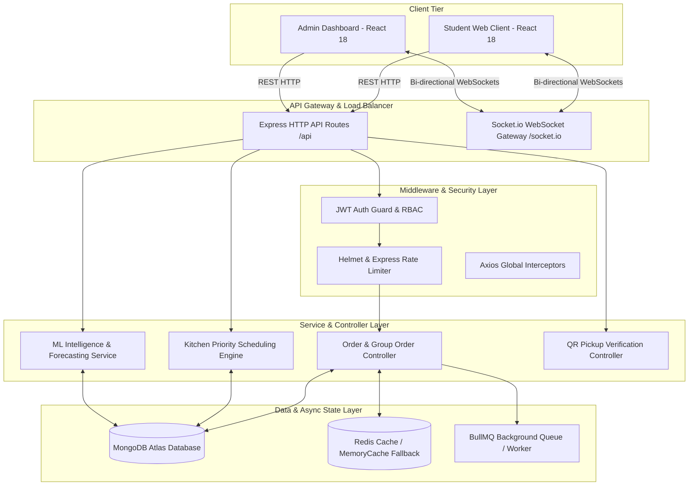
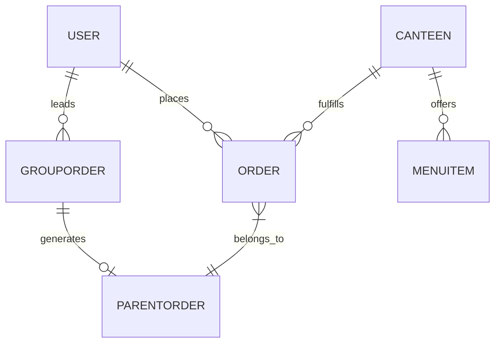
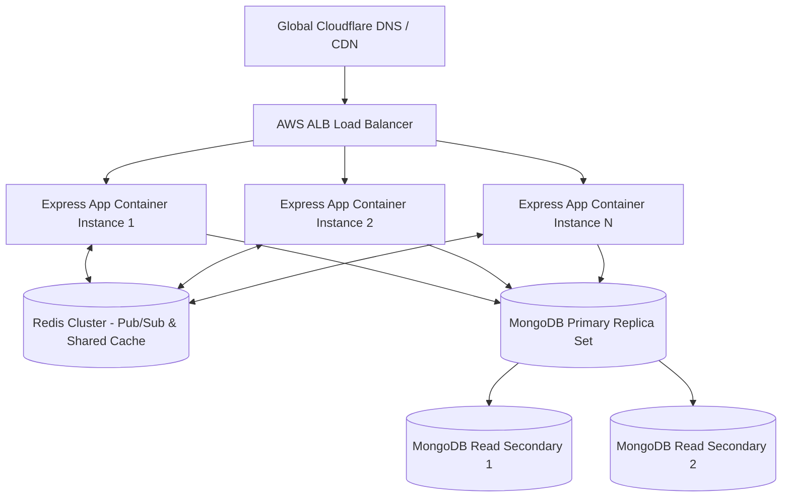

# 📘 Kore Canteen — Complete Master Interview Handbook (15–30 LPA Ready)

> **A Comprehensive, Viva & System Design Interview Handbook for Product Companies (Swiggy, Zomato, Uber, Amazon, Microsoft, etc.)**

---

# 📑 Table of Contents
1. [Chapter 1: Project Overview, Problem Statement & System Architecture](#chapter-1-project-overview-problem-statement--system-architecture)
2. [Chapter 2: Frontend Architecture & Client-Side Design](#chapter-2-frontend-architecture--client-side-design)
3. [Chapter 3: Backend Architecture & API Engineering](#chapter-3-backend-architecture--api-engineering)
4. [Chapter 4: Database Design, Data Models & Indexing](#chapter-4-database-design-data-models--indexing)
5. [Chapter 5: Feature-by-Feature Deep Walkthrough & Workflows](#chapter-5-feature-by-feature-deep-walkthrough--workflows)
6. [Chapter 6: Machine Learning & Algorithmic Foundations](#chapter-6-machine-learning--algorithmic-foundations)
7. [Chapter 7: Architectural Innovations & Engineering Resilience](#chapter-7-architectural-innovations--engineering-resilience)
8. [Chapter 8: Scalability, Production Readiness & System Design Trade-Offs](#chapter-8-scalability-production-readiness--system-design-trade-offs)
9. [Chapter 9: Master Collection of 100+ Interview Questions & Answers](#chapter-9-master-collection-of-100-interview-questions--answers)

---

# Chapter 1: Project Overview, Problem Statement & System Architecture

## 🎙️ 1.1 The 30-Second Elevator Pitch
> *"Kore Canteen is an end-to-end, multi-tenant smart dining and kitchen management platform designed to eliminate long queue bottlenecks in educational institutions and enterprise cafeterias during short break windows.*
> 
> *It features **collaborative group ordering with real-time WebSocket cart synchronization**, **automated multi-shop order splitting (Parent/Child order hierarchy)**, **slot-based pre-ordering**, an **AI demand forecasting model**, a **workload-aware kitchen priority queueing engine**, and **touchless QR-code pickup verification**.*
> 
> *Architecturally, it is built with React 18, Node.js/Express, MongoDB Atlas, Redis with in-memory fallback, BullMQ for background job scheduling, Socket.io for bi-directional live updates, and custom machine learning algorithms for time-series forecasting and queue optimization."*

---

## 🎯 1.2 Problem Statement & Business Motivation
In educational institutions and corporate campuses, thousands of students and employees share a synchronized break window (e.g., 12:30 PM to 1:15 PM). This creates an extreme demand spike over a narrow 45-minute period.

### **Key Operational Bottlenecks:**
1. **Excessive Customer Waiting Time**: Customers spend 25 to 30 minutes of a 45-minute break in line to order and pay, leaving under 10 minutes to eat.
2. **Kitchen Chaos & Unsorted FIFO Processing**: Kitchen staff receive orders verbally or via paper tokens without priority scheduling. High-prep items stall fast beverage orders.
3. **Food Waste & Inventory Stockouts**: Canteen managers guess raw material requirements daily without historical data, leading to early stockouts of popular items or high end-of-day wastage.
4. **Fragmented Group Orders**: Groups ordering from different food counters stall counters while waiting for each other or dealing with split bill calculations.

---

## ⚖️ 1.3 Feature & Operational Comparison Matrix

| Feature / Dimension | Existing Offline Counter System | Traditional Delivery Apps (Swiggy/Zomato) | Kore Canteen Solution |
| :--- | :--- | :--- | :--- |
| **Ordering Model** | On-the-spot physical queueing | On-demand instant delivery | Scheduled break-slot pre-ordering |
| **Queue Time** | 25–30 minutes per meal | N/A (delivery delay 30-45m) | **< 2 minutes (Touchless QR Pickup)** |
| **Group Billing** | Manual cash / split UPI payments | Single payer per address | **Real-time collaborative group cart & automatic multi-shop splitting** |
| **Kitchen Scheduling** | Unsorted FIFO (Paper tokens) | FIFO order queue | **Priority Queue (SPT + Urgency + Aging Boost)** |
| **Demand Forecasting** | Manual intuitive estimation | Regional macro trend ML | **Item-level Exponential Smoothing ($\alpha = 0.6$) per canteen** |
| **Operational Cost** | High counter labor | Delivery fee + high commission | Zero delivery fee, optimized staff allocation |

---

## 🏗️ 1.4 High-Level Architecture Diagram



---

# Chapter 2: Frontend Architecture & Client-Side Design

## 💻 2.1 Core Framework Choice: React 18 + Vite
* **Vite Build System**: Offers instant Hot Module Replacement (HMR) and fast ES-module bundling compared to traditional Create React App / Webpack.
* **Component Architecture**: Modular component hierarchy dividing pages into `/pages/student` and `/pages/admin`, backed by reusable UI elements under `/components/common`.

---

## 🔑 2.2 Global State Management with Context API
Instead of heavy Redux boilerplate, Kore Canteen employs lightweight, focused React Context providers:

1. **`AuthContext`** ([`AuthContext.jsx`](file:///c:/Users/yogi%20venkatachelam/OneDrive/Desktop/korecanteen/frontend/src/context/AuthContext.jsx)):
   * Manages authentication state (`user`, `token`, `loading`).
   * Persists JWT token in `localStorage` under `kct_token`.
   * Automatically executes `/auth/me` on initial render to re-hydrate session state securely.
2. **`CartContext`** ([`CartContext.jsx`](file:///c:/Users/yogi%20venkatachelam/OneDrive/Desktop/korecanteen/frontend/src/context/CartContext.jsx)):
   * Manages persistent single-user cart state (add/remove items, update quantity, select pickup slots).
   * Validates multi-canteen item compatibility.

---

## 🌐 2.3 Network Layer: Standardized Axios Interceptor
All HTTP requests flow through a centralized Axios client ([`axiosInstance.js`](file:///c:/Users/yogi%20venkatachelam/OneDrive/Desktop/korecanteen/frontend/src/api/axiosInstance.js)):

```javascript
const axiosInstance = axios.create({
  baseURL: import.meta.env.VITE_API_URL || 'http://localhost:5001/api',
  timeout: 15000,
  headers: { 'Content-Type': 'application/json' },
});

// Automatic Bearer Token Injection
axiosInstance.interceptors.request.use(
  (config) => {
    const token = localStorage.getItem('kct_token');
    if (token) config.headers.Authorization = `Bearer ${token}`;
    return config;
  },
  (error) => Promise.reject(error)
);
```

---

# Chapter 3: Backend Architecture & API Engineering

## ⚙️ 3.1 Server Setup & Middleware Pipeline
The Node.js/Express backend ([`server.js`](file:///c:/Users/yogi%20venkatachelam/OneDrive/Desktop/korecanteen/backend/server.js)) implements a layered security and processing pipeline:

```
Request -> Helmet -> CORS -> Morgan Logging -> Body Parser -> Rate Limiter -> Router -> Controller -> Global Error Handler -> Response
```

### **Security Hardening Components:**
* **`helmet()`**: Sets HTTP security headers (CSP, HSTS, X-Frame-Options).
* **`cors()`**: Restricts access to authorized origin URLs (`http://localhost:5173`).
* **`express-rate-limit`**: Enforces a max limit of 200 requests per 15 minutes per IP to prevent DDoS attacks.
* **JWT Middleware** ([`authMiddleware.js`](file:///c:/Users/yogi%20venkatachelam/OneDrive/Desktop/korecanteen/backend/middleware/authMiddleware.js)): Extracts Bearer token, verifies secret signature, and attaches user document to `req.user`.

---

# Chapter 4: Database Design, Data Models & Indexing

Kore Canteen relies on 7 core Mongoose schemas designed for strong multi-tenant separation and relational links.



## 🗄️ 4.1 Schema Definitions & Indexes

### 1. **`User`** ([`User.js`](file:///c:/Users/yogi%20venkatachelam/OneDrive/Desktop/korecanteen/backend/models/User.js))
* **Fields**: `name`, `email` (unique index), `password` (hashed with `bcryptjs`), `role` (`student`, `canteen_admin`, `super_admin`), `rollNumber`, `phone`, `canteen` (Ref: Canteen).

### 2. **`Canteen`** ([`Canteen.js`](file:///c:/Users/yogi%20venkatachelam/OneDrive/Desktop/korecanteen/backend/models/Canteen.js))
* **Fields**: `name`, `location`, `description`, `image`, `isOpen`, `admin` (Ref: User), `operatingHours`, `pickupSlots`, `rating`, `totalOrders`.

### 3. **`MenuItem`** ([`MenuItem.js`](file:///c:/Users/yogi%20venkatachelam/OneDrive/Desktop/korecanteen/backend/models/MenuItem.js))
* **Fields**: `name`, `description`, `price`, `category` (`breakfast`, `lunch`, `snacks`, `beverages`, `dinner`), `canteen` (Ref: Canteen, Index), `image`, `isAvailable`, `preparationTime`, `isVeg`, `totalOrdered`.

### 4. **`Order`** ([`Order.js`](file:///c:/Users/yogi%20venkatachelam/OneDrive/Desktop/korecanteen/backend/models/Order.js))
* **Fields**: `orderNumber` (unique), `parentOrder` (Ref: ParentOrder), `student` (Ref: User, Index), `canteen` (Ref: Canteen, Index), `items`, `totalAmount`, `pickupSlot`, `status` (`pending`, `accepted`, `preparing`, `ready`, `completed`, `cancelled`), `paymentStatus` (`pending`, `paid`, `failed`), `razorpayOrderId`, `pickupToken`, `qrCode`, `statusHistory`.

### 5. **`ParentOrder`** ([`ParentOrder.js`](file:///c:/Users/yogi%20venkatachelam/OneDrive/Desktop/korecanteen/backend/models/ParentOrder.js))
* **Fields**: `parentOrderNumber` (unique), `student` (Ref: User), `isGroupOrder`, `groupOrderRef` (Ref: GroupOrder), `totalAmount`, `shopOrders` (Array of Order Refs), `pickupSlot`.

### 6. **`GroupOrder`** ([`GroupOrder.js`](file:///c:/Users/yogi%20venkatachelam/OneDrive/Desktop/korecanteen/backend/models/GroupOrder.js))
* **Fields**: `groupCode` (6-char unique uppercase code), `leader` (Ref: User), `canteen` (Ref: Canteen), `members`, `items`, `totalAmount`, `status` (`active`, `locked`, `placed`), `parentOrder` (Ref: ParentOrder).

---

# Chapter 5: Feature-by-Feature Deep Walkthrough & Workflows

## 👥 5.1 Collaborative Group Ordering & Multi-Shop Splitting Workflow

```
[Student A Creates Room] ──► Generates Code "K8F92A" ──► Socket Room "group_K8F92A"
                                                                │
[Student B & C Join]    ──► Add Items to Cart        ──► Broadcasts "group_cart_updated"
                                                                │
[Leader Finalizes]      ──► Lock Group Room          ──► Create ParentOrder Document
                                                                │
                                            ┌───────────────────┴───────────────────┐
                                            ▼                                       ▼
                                [Sub-Order: CCD Counter]               [Sub-Order: Burger Counter]
```

1. **Room Initialization**: Group Leader selects a canteen and calls `POST /api/group/create`. Backend generates a unique 6-character room code (e.g., `K8F92A`).
2. **WebSocket Room Join**: Connected members join Socket.io room `group_K8F92A`. When any member adds/removes items, backend emits `group_cart_updated` to all connected sockets in that room.
3. **Parent & Child Order Splitting**:
   * Leader clicks **Finalize**. Status changes to `locked`.
   * Group items are grouped by `canteenId`.
   * System creates a master `ParentOrder` record and creates individual child `Order` records for each target canteen kitchen.

---

## 🎟️ 5.2 Touchless QR Code Pickup Verification Workflow
1. Upon payment verification, `orderController.js` generates a 5-character token (`TK-8492`) and encodes a JSON string into a QR code using `qrcode`:
   ```javascript
   const qrData = JSON.stringify({ orderId: shopOrder._id, pickupToken: shopOrder.pickupToken });
   shopOrder.qrCode = await generateQRCode(qrData);
   ```
2. When the student reaches the counter, canteen staff scan the QR code via `QRScannerModal.jsx`.
3. Backend validates token signature, updates order status to `completed`, logs `statusHistory`, and broadcasts a WebSocket notification to the student's phone.

---

# Chapter 6: Machine Learning & Algorithmic Foundations

## 📈 6.1 Demand Forecasting (Time-Series & Exponential Smoothing)

### **Mathematical Formulation**:
For any menu item $i$, tomorrow's forecasted demand $\hat{y}_{i, \text{tomorrow}}$ is calculated in [`demandForecastService.js`](file:///c:/Users/yogi%20venkatachelam/OneDrive/Desktop/korecanteen/backend/services/demandForecastService.js):

$$\hat{y}_{i, \text{tomorrow}} = \alpha \cdot \text{DaySpecificAvg}_i + (1 - \alpha) \cdot \text{OverallAvg}_i$$

* **Smoothing Constant ($\alpha = 0.6$)**: Weights recent day-of-week demand patterns at $60\%$ and historical average at $40\%$.
* **Recommended Safety Buffer**: Adds a $+15\%$ safety stock multiplier:
  $$\text{RecommendedStock} = \text{Math.round}(\hat{y} \cdot 1.15)$$

### **Accuracy Evaluation**:
Computes Mean Absolute Error ($MAE$) & Root Mean Squared Error ($RMSE$):

$$\text{MAE} = \frac{1}{n} \sum_{k=1}^{n} |y_k - \hat{y}_k|, \quad \text{RMSE} = \sqrt{\frac{1}{n} \sum_{k=1}^{n} (y_k - \hat{y}_k)^2}$$

---

## 🧠 6.2 Intelligent Kitchen Priority Scheduling Engine

### **Mathematical Ranking Formula**:
Kitchen orders are dynamically ranked in [`schedulingService.js`](file:///c:/Users/yogi%20venkatachelam/OneDrive/Desktop/korecanteen/backend/services/schedulingService.js) using:

$$\text{PriorityScore} = (0.30 \cdot \text{SPTScore}) + (0.40 \cdot \text{UrgencyScore}) + \text{AgingScore}$$

1. **Shortest Processing Time (SPT Score)**:
   $$\text{SPTScore} = \min\left(100, \frac{1000}{\max(2, \text{EstPrepTime})}\right)$$
2. **Pickup Urgency Score**:
   $$\text{UrgencyScore} = \begin{cases} 
   100 & \text{if remaining deadline } \le 5\text{ mins} \\
   75 & \text{if remaining deadline } \le 15\text{ mins} \\
   50 & \text{if remaining deadline } \le 30\text{ mins} \\
   25 & \text{otherwise}
   \end{cases}$$
3. **Starvation Aging Boost**:
   $$\text{AgingScore} = \text{WaitTimeInMinutes} \times 6$$

---

# Chapter 7: Architectural Innovations & Engineering Resilience

## 🛡️ 7.1 Dual Caching Layer with Automatic MemoryCache Fallback
To ensure high availability, [`redis.js`](file:///c:/Users/yogi%20venkatachelam/OneDrive/Desktop/korecanteen/backend/config/redis.js) provides a resilient caching interface:

```javascript
// Graceful Redis -> MemoryCache Fallback Pattern
const cacheManager = {
  async get(key) {
    if (isRedisConnected && redisClient) {
      try { return await redisClient.get(key); } catch (e) {}
    }
    return await memoryStore.get(key);
  },
  async set(key, value, ttlSeconds = 300) {
    const valString = typeof value === 'object' ? JSON.stringify(value) : String(value);
    if (isRedisConnected && redisClient) {
      try { return await redisClient.set(key, valString, 'EX', ttlSeconds); } catch (e) {}
    }
    return await memoryStore.set(key, valString, 'EX', ttlSeconds);
  }
};
```

---

## ⏱️ 7.2 Asynchronous Background Job Cancellation (BullMQ)
* Schedules delayed order cancellation jobs (`cancel_unpaid_order`) 15 minutes after order creation ([`queue.js`](file:///c:/Users/yogi%20venkatachelam/OneDrive/Desktop/korecanteen/backend/jobs/queue.js)).
* Includes a built-in `setTimeout` fallback worker when Redis is offline.

---

# Chapter 8: Scalability, Production Readiness & System Design Trade-Offs

## 🚀 8.1 Scaling to 100,000+ Active Users (Production Architecture)



### **Scaling Enhancements:**
1. **Stateless App Servers**: Express servers hold no in-memory session state; all sessions rely on signed JWTs.
2. **Socket.io Redis Adapter**: Enables multi-node WebSocket broadcasting across N container instances via Redis Pub/Sub.
3. **Database Read Replicas**: Direct all analytics & menu read queries to MongoDB Secondary read nodes using `readPreference=secondaryPreferred`.

---

# Chapter 9: Master Collection of 100+ Interview Questions & Answers

### **Q1: Why MongoDB instead of SQL (PostgreSQL/MySQL)?**
> *"Food menu schemas and order documents are inherently hierarchical and flexible. An order contains an array of nested menu item snapshots. In SQL, this requires joining `users`, `orders`, `order_items`, and `menu_items`. MongoDB document storage allows atomic reads/writes of an entire order payload in a single query."*

### **Q2: How do you prevent double-spending or duplicate order finalization during group orders?**
> *"When a Group Leader clicks Finalize, we execute an atomic update query in MongoDB checking `status: 'active'`. If the document state updates to `'locked'`, sub-orders are created. Subsequent concurrent finalize attempts fail the query check."*

### **Q3: What happens if Redis goes down during operational peak?**
> *"Our dual-cache manager automatically intercepts Redis client errors and falls back to an internal `MemoryCache` (JavaScript Map with TTL expiry). The application degrades gracefully without throwing HTTP 500 errors."*

### **Q4: Why use Socket.io instead of Server-Sent Events (SSE) or Polling?**
> *"Short polling generates excessive HTTP request overhead. SSE is unidirectional (Server to Client). Socket.io provides bi-directional communication, automatic reconnection, and socket room partitioning (`group_CODE`, `canteen_ID`)."*

### **Q5: How does the priority queue prevent large/complex orders from waiting forever?**
> *"Through Starvation Aging. Every minute an order waits in queue, it accumulates $+6$ priority points. Even if fast 1-item prep orders arrive, the aging component eventually forces long-waiting complex orders to out-score new quick orders."*

---
*End of Master Interview Handbook — Ready for 15–30 LPA System Design & Technical Interviews!*
